<!-- _class: lead -->
<!-- _paginate: false -->

<p class="eyebrow">BIOINFORMATICS · NGS PIPELINES</p>

# Methods & Workflow of a Bioinformatics Pipeline Analysis

## Reading any NGS pipeline as one skeleton with swappable parts

- Audience: grad / early-career researchers — biology-comfortable, NGS-newer
- Format: lecture (these slides) + notes handout + hands-on lab

<!-- Set expectations: by the end they read any NGS pipeline as one skeleton with swappable parts, and will have run both an alignment and an assembly pass themselves. -->

---

## Why this class exists

- Bioinformatics *looks* like 4 unrelated workflows — variants, RNA-seq, metagenomics, ...
- It's really **ONE skeleton** with different middle/back ends
- Learn the skeleton once → **instantiate forever**

<!-- Name the pain: students drown memorizing tool zoos. Reframe: tools are implementations of stages; stages are stable. This is the whole thesis of the course. -->

---

<!-- _class: skeleton -->

<p class="eyebrow">THE BACKBONE</p>

## The universal pipeline skeleton

```
Design → QC → Preprocess → Core (ALIGN / ASSEMBLE) → Downstream → Interpret
                                                          ↳ Reproducibility wraps all
```

- Each junction is a **file format**
- Front half **shared**; back half **branches**

<!-- Walk left to right once. Emphasize the fork at "Core" and that reproducibility is the box around everything, not a final step. This diagram returns every module. -->

---

## Roadmap & how to use the materials

- **6 modules**; ~3–4 h lecture + 2 h lab
- Notes for self-study · slides for delivery · hands-on for the lab
- Three parallel domain modules (3a / 3b / 3c) — survey all or pick one

<!-- The lab deliberately makes them take both forks: align+call on E. coli, assemble+identify on a phage. -->

---

<!-- _class: skeleton -->

<p class="eyebrow">MODULE 0 · FOUNDATIONS</p>

## Foundations — stage: Design + formats

```
[DESIGN] → QC → Preprocess → Core → Downstream → Interpret → Reproducibility
```

- What a pipeline is; why we formalize it: **reproducibility, scale, reasoning**

<!-- "Pipeline = plumbing; junctions are file formats." Most pain is format-wrangling. GUI alternative (GTN): Galaxy Basics for genomics → training.galaxyproject.org/training-material/topics/introduction/ -->


---

## Sequencing platforms

- **Short read** (Illumina) vs **long read** (ONT / PacBio HiFi)
- Trade-offs: read length · accuracy · throughput / cost

<!-- The platform is the FIRST fork — it cascades into aligner, assembler, error model. -->

---

## The platform cascade

- **ONT** → minimap2 (not BWA), Flye (not SPAdes), indel-heavy error profile
- **Illumina** → BWA / Bowtie2, SPAdes / MEGAHIT, accurate SNVs

> A Module-0 choice **silently rewrites** your Module-2/3 toolset.

<!-- Hammer the cascade: the platform is not a detail, it's the first fork in the road. -->

---

<!-- _class: skeleton -->

<p class="eyebrow">MODULE 0 · SHORT-READ SPOTLIGHT</p>

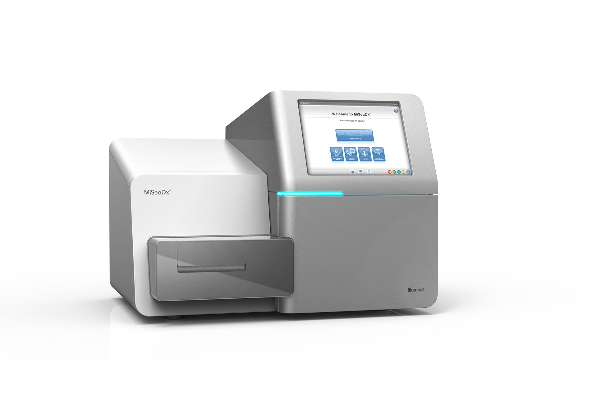
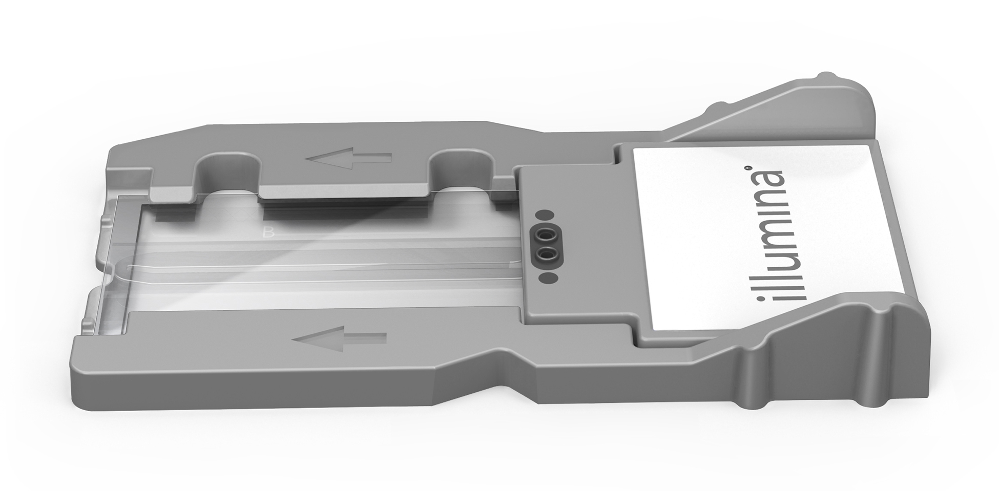

## Illumina: the high-accuracy workhorse

- Fragment → ligate P5/P7 adapters + index → bridge-amplify → **SBS** → FASTQ
- Highest accuracy (Q30+), highest throughput, cheapest per base; paired-end
- Short-read limit: cannot span long repeats or large structural variants

<!-- The short-read workhorse. Right column: the Illumina MiSeqDx sequencer (top) + its flow-cell consumable (bottom). Walk the four-step loop: library prep → cluster amplification → SBS imaging → FASTQ. Sell the strengths, then be honest about the limit: short reads can't span repeats, which is exactly why this branch uses BWA/Bowtie2 + SPAdes/MEGAHIT. -->

---

<p class="eyebrow">MODULE 0 · SBS WORKFLOW</p>

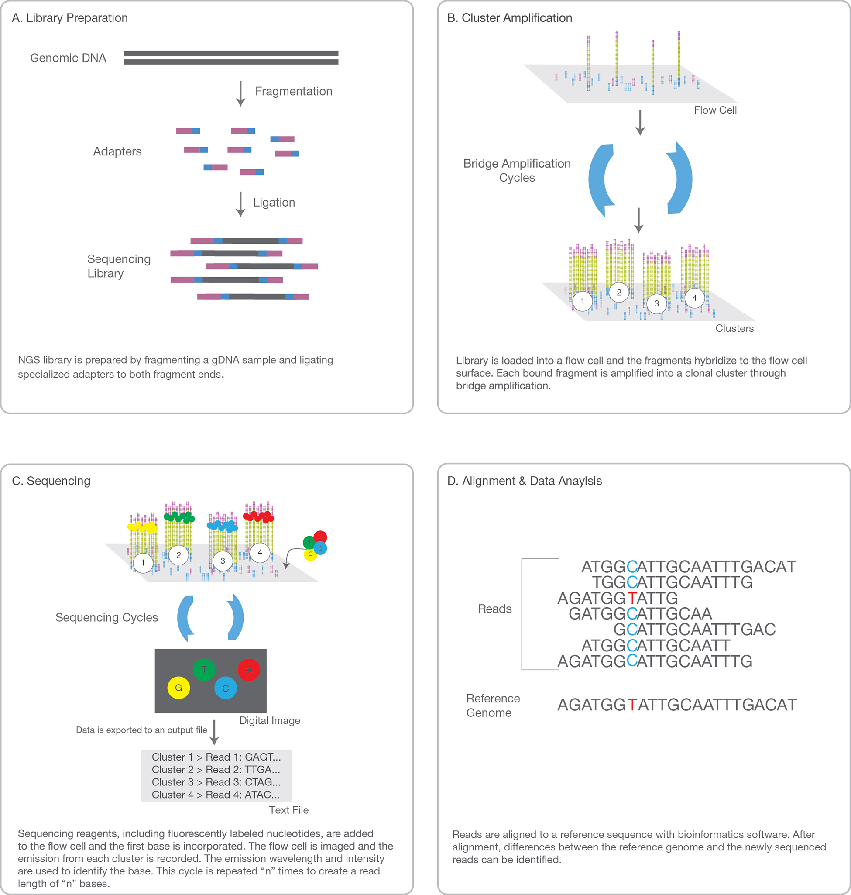

## Illumina SBS: step by step

- **(A) Library prep** — fragment + ligate P5/P7 adapters + index
- **(B) Cluster amplification** — bridge-amplify → clonal clusters
- **(C) Sequencing-by-synthesis** — 1 reversible terminator / cycle → image → cleave → repeat
- **(D) Alignment & analysis** — align reads → call variants / counts

<!-- The four-panel figure (right) IS the A→D walkthrough. The index enables multiplexing; the cluster step is why signal is detectable — one molecule is invisible, a clonal cluster is not. -->

---

<p class="eyebrow">MODULE 0 · SBS — STEP A IN DETAIL</p>

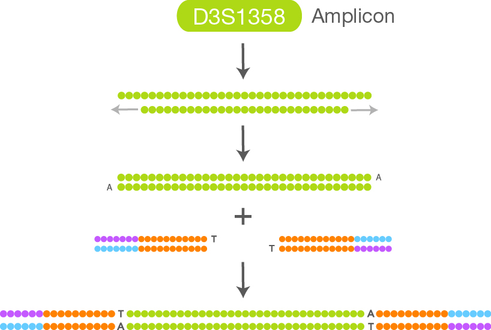

## Library prep: adapters on every fragment

```
1  Fragment (shear gDNA to target insert size)
2  Ligate P5 / P7 adapters + sample index onto both ends  (A·T overhang)
3  Sequencing-ready library:
      flow-cell handle  |  amplification primer  |  index  |  sequencing primer
```

- Every fragment gets **both adapters** — the index inside enables multiplexing
- Many samples → one run → demultiplex by barcode after sequencing

<!-- A zoom on step (A). The adapters are the handles that allow the fragment to do everything else. The index is what makes multiplexing possible. -->

---

<p class="eyebrow">MODULE 0 · ILLUMINA ARRAY GENOTYPING</p>

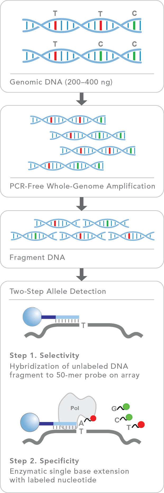

## Illumina genotyping array: a different workflow

- **BeadArray SNP genotyping — not SBS**
- (1) 200–400 ng gDNA → (2) PCR-free whole-genome amplification → (3) fragment
- (4) Hybridize to 50-mer locus-specific probe → single-base extension with fluorescent dNTP → genotype by color

> No flow cell, no cluster amplification, no quality string — you get a genotype call per probe.

<!-- Flag this explicitly: the Infinium array is a completely different Illumina platform. Students often conflate the two. -->

---

<!-- _class: skeleton -->

<p class="eyebrow">MODULE 0 · LONG-READ SPOTLIGHT</p>

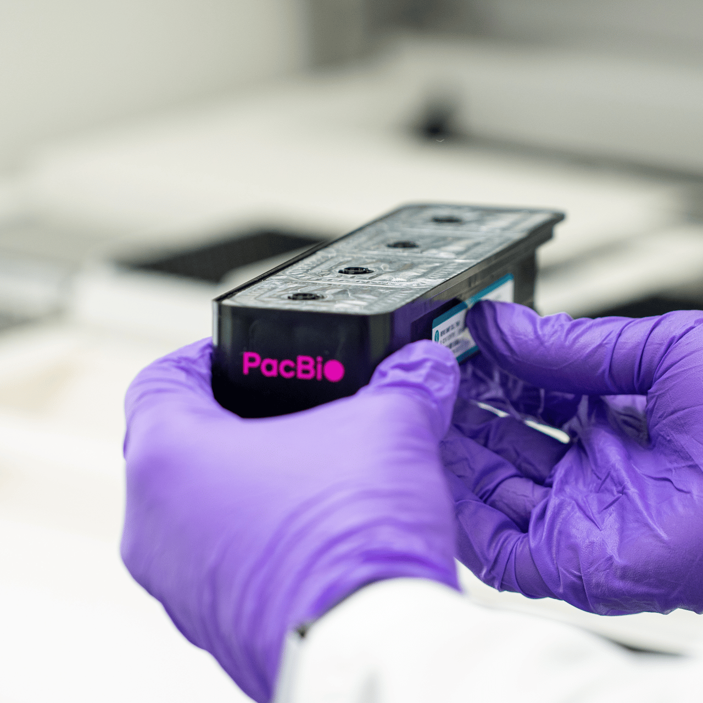

## PacBio HiFi: long AND accurate

- Polymerase in a **ZMW** reads a circular **SMRTbell** template repeatedly → **CCS** → HiFi read
- Long (~10–25 kb) **and** accurate (Q30+) — circular consensus cancels per-pass error
- Gold standard for de novo assembly, phasing, and full-length amplicons

<!-- The accurate long-read platform. ZMW = zero-mode waveguide. SMRTbell = hairpin-capped circular template. Many passes → CCS → Q30+. Trade-off: more expensive and lower throughput than Illumina; pairs with minimap2 + hifiasm/Flye. -->

---

<p class="eyebrow">MODULE 0 · HIFI IN PRACTICE</p>

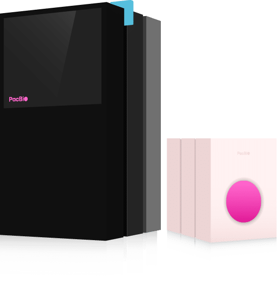

## PacBio HiFi in practice: full-length 16S profiling

- Amplify V1–V9 (~1,500 bp) with **dual-barcoded primers** → pool → SMRTbell library → HiFi sequence
- HiFi reads the **entire amplicon** → species/strain-level taxonomy (short V3–V4 cannot)
- Dual-index plate layout → up to **192 samples** per run

> Short reads top out at genus. HiFi resolves to species or strain.

<!-- The key insight: full-length amplicons + HiFi accuracy = the species/strain resolution that short-read V3-V4 fragments simply cannot achieve. -->

---

<!-- _class: skeleton -->

<p class="eyebrow">MODULE 0 · LONG-READ SPOTLIGHT</p>

## MinION: nanopore sequencing in your palm

- DNA through a protein nanopore → **ionic-current squiggle** → basecaller (Dorado) → FASTQ
- **Real-time & portable** — USB-powered, palm-sized; reads stream as they sequence
- **Ultra-long reads** (>100 kb possible); trade-off: indel-heavy error profile → minimap2 + Flye

<!-- Sell the three superpowers: real-time, portable, ultra-long. Be honest about the trade-off: higher per-base error (especially indels in homopolymers), mitigated by modern basecallers and depth. This is exactly why the ONT branch uses minimap2 (not BWA) and Flye (not SPAdes). -->

---

<p class="eyebrow">MODULE 0 · ONT IN PRACTICE</p>

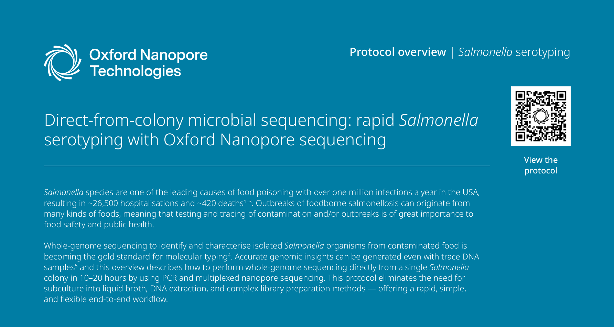

## MinION in practice: Salmonella colony → serotype same day

- **Direct-from-colony**: pick colony → Rapid PCR Barcoding Kit (SQK-RPB114.24) → 24 barcoded samples → R10.4.1 flow cell
- MinKNOW real-time HAC basecalling → EPI2ME `wf-bacterial-genomes` → Flye assembly + Medaka polish
- Output: species ID + serotype + 7-gene MLST + AMR profile — **no DNA extraction required**

> This is the ASSEMBLE branch in action — the genome is reconstructed de novo.

<!-- Threads every ONT concept together: direct-from-colony = skip extraction; real-time basecalling; EPI2ME workflow = nf-core equivalent for ONT. Output is assembly-based, not alignment-based. -->

---

## Experimental design

- **Replicates** (biological ≫ technical), **controls**, depth / coverage
- **Batch effects**: randomize conditions across batches, record batch as metadata

<!-- Bioinformatics can't rescue a confounded design. The March/June batch story — a recurring cautionary tale; it returns in Module 4. -->

---

## File formats: the connective tissue

- FASTA · FASTQ · SAM/BAM/CRAM · VCF · GFF/GTF · BED
- Each format = **output of one stage, input of the next**

<!-- Don't memorize columns; learn which stage emits each. Detail on the next slides. -->

---

## FASTQ & Phred quality

- 4 lines / read; quality string = per-base **Phred** (Q = −10·log₁₀ P)
- Q20 = 1% error · Q30 = 0.1% · **Phred+33** ASCII encoding

<!-- This quality string is the entire reason QC (Module 1) exists. Quick ASCII demo: char − 33 = Q. -->

---

## BAM, VCF, GFF / BED in one breath

- **BAM** = aligned reads (POS, MAPQ, CIGAR)
- **VCF** = variants · **GFF/GTF** = features · **BED** = plain intervals
- BED is **0-based**; GFF/VCF **1-based** (off-by-one trap)

<!-- "BED counts from zero" — say it twice; it bites everyone once. -->

---

## Worked example: one read, FASTQ → BAM → VCF

```
FASTQ   quality letter (low-Q 3' tail)
  ↓  align
BAM     CIGAR mismatch + soft-clip, MAPQ 60
  ↓  call
VCF     0/1 genotype, DP=31, PASS
```

- Same observation, three formats — the **read never changes**

<!-- The whole pipeline in one slide. Return to this image whenever someone is lost. -->

---

<!-- _class: skeleton -->

<p class="eyebrow">MODULE 1 · QC & PREPROCESSING</p>

## QC & Preprocessing

```
Design → [QC] → [PREPROCESS] → Core → Downstream → Interpret → Reproducibility
```

- Garbage in → garbage out; **cheapest place to catch disaster**

<!-- Raw FASTQ is NOT trustworthy raw material — adapters, low-qual tails, contaminants. GUI alternative (GTN): Quality Control (+ Nanoplot/PycoQC for long reads) and Quality & contamination control in a bacterial isolate → topics/sequence-analysis/tutorials/quality-control/ and .../quality-contamination-control/ -->

---

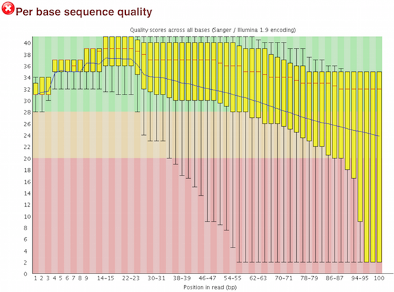

## FastQC: the metrics that matter

- Per-base quality · adapter content · overrepresented seqs · duplication · GC
- Pass / Warn / Fail = a **prompt, not a verdict**
- Make the GC second-peak explicit: **screen contamination** with Kraken2/Bracken

<!-- "Read FastQC like a doctor reads a chart" — interpret in the context of the library type. A GC second peak only hints at contamination; a taxonomic screen (Kraken2) confirms the sample is your target species. Full profiling is Module 3c. -->

---

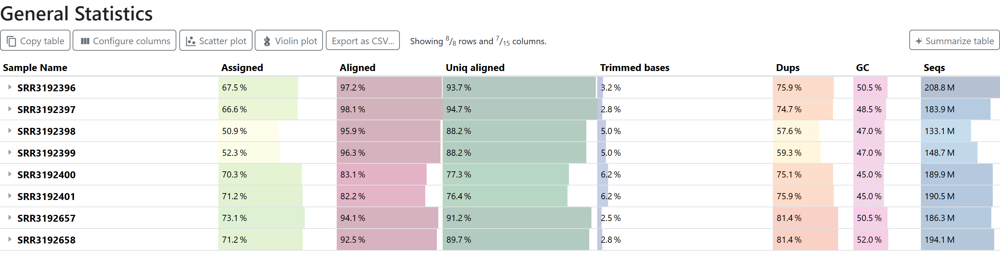

## MultiQC: aggregate & spot the outlier

- **One report**, all samples, every step
- The **outlier view** is the payoff

<!-- Highest value / lowest effort tool in the course. Run it after every batch step. -->

---

<p class="eyebrow">MODULE 1 · LONG-READ QC</p>

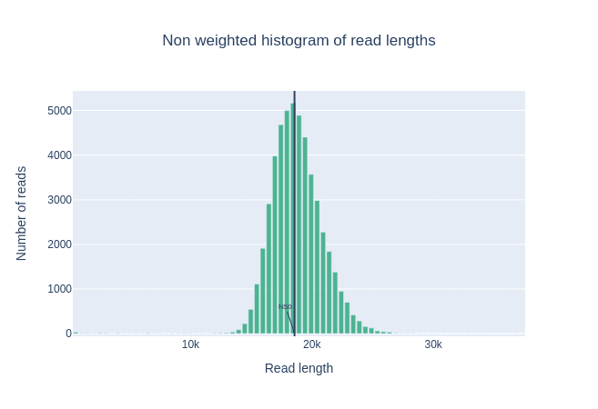

## Long reads need different QC tools

- FastQC's plots assume **short, fixed-length** reads
- **Nanoplot** — read-length × quality (the long-read analog of the FastQC panels)
- **PycoQC** — Nanopore *run* health: per-channel activity, yield over time, basecall quality

> Read-length distribution is the headline metric — a healthy ONT run is **long-tailed**.

<!-- Module 0 spent three slides on ONT/PacBio, but QC tools so far were short-read only. Nanoplot is the everyday long-read QC; PycoQC reads the MinKNOW run. A collapse toward short reads = degraded input or failing pores. Long-read trimming/filtering (Porechop, filtlong) shows up in the Module 2 assembly workflow. -->

---

## Trimming tools

| Tool | Role |
|------|------|
| **fastp** | **default** — all-in-one: adapters, quality, length + report |
| **Trimmomatic** | explicit / legacy, fine control |
| **cutadapt** | adapter / primer specialist |

<!-- fastp = one fast pass + its own report. Show the table; default to fastp. -->

---

## Decision rules

- **Always** remove adapters; quality-trim **only** decayed 3' tails
- **Don't over-trim** (hurts mappability); don't hard-trim the 5' wobble
- Paired-end: **keep mates in sync** — use a pair-aware tool

<!-- By goal — variants: light trim; assembly: more; pseudo-align RNA: often adapters only. -->

---

## Module 1 checkpoint

- A **duplication FAIL** on a deep RNA-seq library — panic?

> **No.** High duplication is *expected* in deep RNA-seq. Interpret QC in context.

<!-- Use as a discussion beat; let them answer before revealing. -->

---

<!-- _class: skeleton -->

<p class="eyebrow">MODULE 2 · CORE PROCESSING</p>

## Core processing — THE BRANCH POINT

```
Design → QC → Preprocess → [ ALIGN / ASSEMBLE ] → Downstream → Interpret
```

- Everything before = **shared**; everything after = **diverges here**

<!-- The single most important conceptual slide. Slow down. GUI alternative (GTN): Mapping (align) + Genome Assembly intro, MRSA Illumina/Nanopore, Hybrid assembly, and Assembly Quality Control (QUAST/BUSCO/Merqury) → topics/sequence-analysis/tutorials/mapping/ and topics/assembly/ -->

---

## The fork: do you already have a map?

- **Align**: "how does my sample differ from a known genome?" → **BAM**
- **Assemble**: "what is the sequence I just got?" → **FASTA**
- Jigsaw *with* the box picture (align) vs *without* it (assemble)

<!-- The decision rule = does a trustworthy reference exist? -->

---

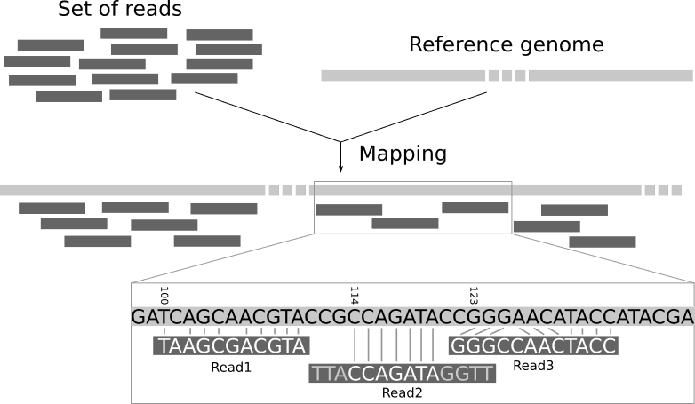

## Aligners

- **BWA-MEM** (DNA / variants) · **Bowtie2** (general / ChIP) · **minimap2** (long reads)
- Right reference, **indexed**, documented

<!-- Spliced RNA aligners (STAR/HISAT2) are a special case → Module 3b. -->

---

## Reads → usable BAM (samtools)

```bash
bwa mem -t4 ref.fa R1.fq.gz R2.fq.gz | samtools sort -o s.bam -
samtools index s.bam ; samtools flagstat s.bam
```

- Low **% mapped** = wrong ref / contamination / adapters

<!-- samtools is the swiss-army knife. flagstat is your first reality check. -->

---

## De novo assembly

- **SPAdes** (isolate/meta) · **MEGAHIT** (big metagenomes) · **Flye** (long read)
- **Shovill** (SPAdes wrapper for bacterial isolates) · **Unicycler** (hybrid short+long)
- de Bruijn graphs (short) vs overlap (long)

<!-- No reference → reconstruct by overlap. Compute / memory heavy. Shovill is the pragmatic default for one short-read bacterial genome; when you have both Illumina and ONT, hybrid (Unicycler) beats either alone. -->

---

<p class="eyebrow">MODULE 2 · LONG-READ ASSEMBLY</p>

## Long-read prep & polishing

- **Prep first** — **Porechop** (adapters) + **filtlong** (keep best reads) + Nanoplot QC
- **Polish after** — **Medaka** (ONT consensus) · **Pilon** / **Polypolish** (short reads)
- Polishing lifts a raw **Flye** draft from ~Q30 to near-finished

> Long-read drafts carry indel/homopolymer errors — polishing is not optional.

<!-- Two steps short-read work doesn't have. Hybrid in disguise: long-read assemble, then short-read polish (Pilon/Polypolish) = the same short+long combination Unicycler automates. -->

---

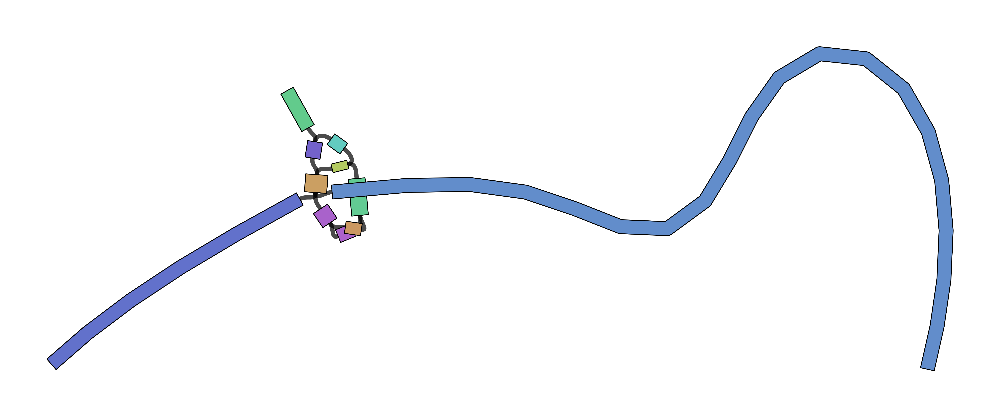

## Judging an assembly: N50 & friends

- **contig count** · **N50** (contiguity) · total length · completeness (BUSCO / CheckV)
- **Merqury** (k-mer QV, reference-free) · **Bandage** (look at the assembly *graph*)

> **N50 rewards length, not correctness** — always pair it with completeness.

<!-- The "higher N50 but 71% complete" trap (returns in the checkpoint). Merqury estimates consensus quality from read k-mers with no reference; Bandage shows tangles (repeats/contamination) the linear FASTA hides. -->

---

## Mapping domains to branches

| Domain | Branch |
|--------|--------|
| Variant calling | **ALIGN** |
| RNA-seq | **ALIGN** / pseudo-align |
| Phage / metagenomics | **ASSEMBLE** |

<!-- The line to memorize: variants & RNA-seq usually align; metagenomics/phage usually assemble. The lab makes them do both. -->

---

<!-- _class: skeleton -->

<p class="eyebrow">MODULE 3a · VARIANT CALLING</p>

## Variant calling — ALIGN branch

```
... → Core (ALIGN) → [VARIANT CALLING] → Interpret
```

- BAM → where & how does the sample differ → **does it matter?**

<!-- This branch consumes the aligned BAM. Germline vs somatic. GUI alternative (GTN): Microbial Variant Calling (Snippy, bacterial), M. tuberculosis Variant Analysis (AMR/drug-resistance), Exome-seq (clinical) → topics/variant-analysis/ -->

---

## GATK Best Practices arc

```
BAM → MarkDuplicates → BQSR → HaplotypeCaller → joint genotyping → filter → VCF
```

- Each step kills a **specific** false-call source

<!-- Dedup + BQSR make the evidence honest; HaplotypeCaller makes calls; filtering keeps the defensible ones. -->

---

## Alternative callers

- **bcftools** — light / bacterial (used in the lab)
- **Snippy** — bacterial all-in-one (align + call + effects); the microbial standard
- **FreeBayes** — haplotype Bayesian; pooled / odd ploidy · **DeepVariant** — DL, long reads
- **Mutect2** — somatic (tumor / normal)

<!-- Right tool for scale. GATK's full arc is overkill on a phage / E. coli genome. Snippy is the de-facto bacterial pipeline (the GTN microbial labs use it); FreeBayes is Snippy's engine and handles non-diploid samples. -->

---

## VCF anatomy

```
CHROM POS ID REF ALT QUAL FILTER INFO   FORMAT  sample
chr7  ...  . G   A   312  PASS   DP=54  GT:AD:DP 0/1:27,27:54
```

- **GT**: 0/0 hom-ref · 0/1 het · 1/1 hom-alt — DP / AD / GQ are trust signals

<!-- Read one row aloud as a sentence. -->

---

<p class="eyebrow">MODULE 3a · BEFORE ANNOTATION</p>

## Normalize variants first

- The same indel can be written several equivalent ways
- **`bcftools norm -f ref.fa -m -`** — left-align indels + split multi-allelic sites
- Un-normalized → won't match **ClinVar / gnomAD** or another caller's VCF → annotation silently misses

> A standard step in the GTN exome/somatic labs — do it before annotating or comparing VCFs.

<!-- Easy to skip, quietly costly. Two callers can emit the "same" variant at different positions/representations; normalization makes them comparable and lets annotation databases match. -->

---

## Annotation: coordinate → consequence

- **VEP** / **SnpEff** / **ANNOVAR**
- Gene · consequence · **gnomAD frequency** · in-silico scores (CADD, SIFT, SpliceAI)

<!-- Raw VCF says where, not what it does. Annotation feeds interpretation. -->

---

## Clinical interpretation: ACMG/AMP + ClinVar

- 5 tiers: **Pathogenic → VUS → Benign**; criteria PVS1 / PS / PM2 / PP3 / BA1...
- **ClinVar** = prior interpretations; **VUS** is the honest common verdict

> A statistical call ≠ a diagnosis. Be conservative; state uncertainty.

<!-- Ties to VariantScribe — keep ACMG/ClinVar terminology aligned with that project. -->

---

<!-- _class: skeleton -->

<p class="eyebrow">MODULE 3b · RNA-SEQ</p>

## RNA-seq — ALIGN / pseudo-align

```
... → Core (ALIGN / pseudo-align) → [QUANTIFY] → Diff. expression → Interpret
```

- Measure how much each gene is expressed; the twist: **introns removed → reads span junctions**

<!-- Why DNA aligners don't suffice for mRNA. GUI alternative (GTN): Reference-based RNA-Seq + reads-to-counts/counts-to-genes + genes-to-pathways (enrichment) → topics/transcriptomics/ -->

---

## Two routes to counts

- **A** — spliced alignment (STAR / HISAT2) + featureCounts / HTSeq (or **DEXSeq** for exon usage)
- **B** — pseudo-alignment (Salmon / kallisto) + tximport — the fast default

<!-- Want counts for DE? Salmon. Need alignments (isoforms / RNA variants, differential exon usage via DEXSeq)? STAR. -->

---

<p class="eyebrow">MODULE 3b · A COMMON TRAP</p>

## Strandedness: the silent count-killer

- Preps are unstranded / forward / reverse → `featureCounts -s 0/1/2` must match
- Wrong setting → counts come back **near-zero** for every gene, **no error**
- **Infer it first** — RSeQC *Infer Experiment* (or Salmon auto-detects)

> The run "succeeds." The counts are garbage. Check strandedness before you count.

<!-- A classic that wastes a day. Pseudo-aligners detect strandedness automatically — one less foot-gun. If a whole-experiment count matrix looks empty, suspect this first. -->

---

## The count matrix

```
        ctrl_1 ctrl_2 treat_1 treat_2
GENE_A    412    388     820     795
GENE_B      2      0       3       1
```

- genes × samples — **filter low-count genes** before testing

<!-- The convergence point: both routes end here; it's the DE input. -->

---

## Normalization: raw counts lie

- Library size · gene length · **composition**
- CPM / TPM (within-sample) vs DESeq2 size factors / edgeR TMM (across-sample DE)

> **Don't feed TPM to DESeq2** — it wants raw counts.

<!-- The most common RNA-seq mistake. Say the "raw counts" rule explicitly. -->

---

## Differential expression (DESeq2 / edgeR)

- **Negative binomial** (DESeq2 / edgeR); size factors → dispersion → GLM → test
- **limma-voom** — a third engine: log-CPM + precision weights, robust with many samples
- Output: **log2FC** + **padj**; `lfcShrink` for stable effect sizes

<!-- n ≥ 3 replicates floor; more replicates beat more depth. Any of the three is defensible — pick one and report it (limma-voom is the GTN default). -->

---

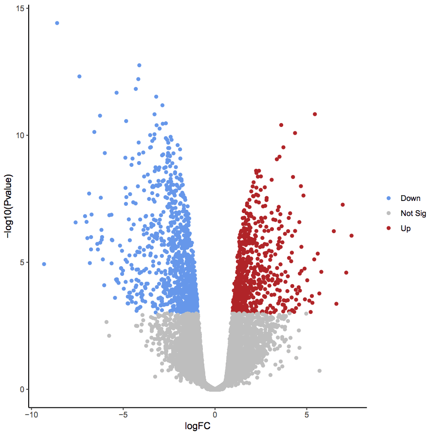

## Multiple testing & the volcano

- ~20k genes → ~1000 false "hits" at p<0.05 → use **BH FDR (padj)**
- Combine padj threshold **with** effect size; volcano / MA plots

> Significant ≠ meaningful (padj 1e-30, log2FC 0.08).

<!-- The big idea. Don't rank by p-value alone. -->

---

<p class="eyebrow">MODULE 3b · FROM LIST TO BIOLOGY</p>

## Functional enrichment

- A DE table is a means, not the end — which **pathways / processes** moved?
- **ORA** (goseq — RNA-seq length-aware) on the significant list
- **GSEA** (fgsea) ranks *all* genes — catches many small coordinated shifts; **KEGG / Pathview** to map

> The trap: use the right **background** (expressed genes, not the genome) and correct length bias.

<!-- The missing downstream — the notes end at the gene list, real analysis continues here. ORA thresholds then tests over-representation; GSEA needs no threshold. goseq corrects the bias that makes long genes look enriched. -->

---

<!-- _class: skeleton -->

<p class="eyebrow">MODULE 3c · PHAGE / METAGENOMICS</p>

## Phage / metagenomics — ASSEMBLE branch

```
... → Core (ASSEMBLE) → [VIRAL ID] → Taxonomy → Annotation → Interpret
```

- Novel, uncultured genomes; **no single reference** · lean: virome / phage

<!-- Why assemble not align — alignment only sees the known. GUI alternative (GTN): Metagenomics assembly + Binning (MAGs) + Host removal + Taxonomic profiling + Pathogen detection (Nanopore foodborne) → topics/microbiome/ (phage/virome coverage thinner — geNomad/CheckV/Pharokka stay CLI primary) -->

---

## Host removal → assembly

- Strip host / PhiX reads (keep non-host)
- **metaSPAdes** / **MEGAHIT** / **Flye --meta**

<!-- A phage prep is mostly host DNA; also a privacy step for human samples. -->

---

<p class="eyebrow">MODULE 3c · THE BACTERIAL SIDE</p>

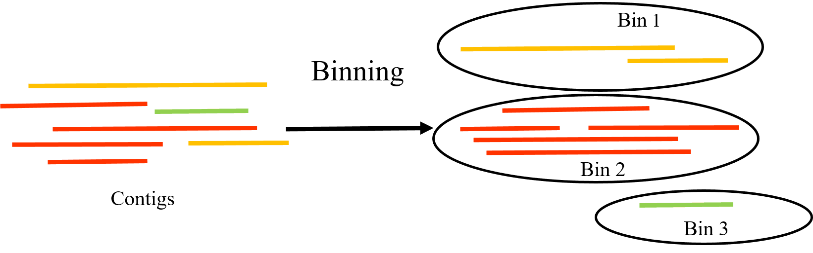

## Binning → MAGs

- The same assembly feeds the **bacterial** side, not just viruses
- **MetaBAT2 / MaxBin2** (bin) → **DAS Tool / Binette** (reconcile) → **CheckM** (quality) → **dRep** (de-dup)
- Groups contigs into **MAGs** by tetranucleotide signature + coverage

> CheckM is the bacterial analog of CheckV — completeness + contamination per genome.

<!-- This module follows the viral contigs, but binning recovers the organisms. Reach for it when you want "who is here, as genomes," not just read-level taxonomy. -->

---

## Viral identification

- **geNomad** / **VirSorter2** score contigs for viral signal; find proviruses

<!-- The output of assembly is an undifferentiated contig pile; this separates the viral wheat. -->

---

## CheckV: how good is each viral genome?

- **Completeness** + **contamination** + provirus trimming
- Viral analog of BUSCO / QUAST — completeness ≠ contiguity

> 18% contamination ≈ host DNA flanking an integrated **prophage**.

<!-- Report phages with their CheckV quality tier. -->

---

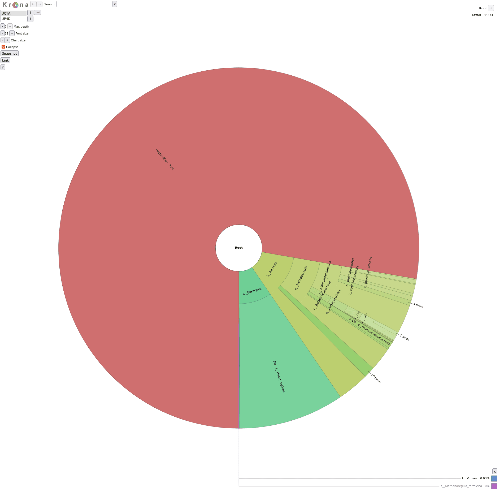

## Taxonomy: Kraken2 + Bracken

- **Kraken2** classifies reads; **Bracken** re-estimates abundance
- **MetaPhlAn** — marker-gene alternative (cleaner species/strain, smaller DB); cross-check
- Database caveat: **novel phages = unclassified** (that's the interesting bit)

<!-- Exactly why assembly + CheckV matters — characterize the unknown. Kraken2 = k-mer (sees everything in the DB); MetaPhlAn = clade markers (fewer spurious low-level hits). Visualize either with Krona/Pavian. -->

---

## Phage annotation: Pharokka

- **PHANOTATE** gene calling + **PHROGs** DB; phage-tuned; genome map
- Prokka / Bakta = general bacterial (more "hypothetical protein")

<!-- Phage genes sparse in generic DBs → use the phage-specialized tool. -->

---

<p class="eyebrow">MODULE 3c · PATHOGEN CHARACTERIZATION</p>

## When it's a pathogen: AMR / virulence / typing

- **ABRicate** — screen contigs for AMR + virulence genes
- **MLST** — sequence type for outbreak tracking · **bcftools consensus / medaka** — consensus genome
- **FastTree** — phylogeny to compare isolates

> This is the Module-0 *Salmonella* example: serotype + 7-gene MLST + AMR, end to end.

<!-- Shifts the annotation question from "what gene" to "is it resistant, virulent, which strain." The GTN foodborne Nanopore tutorial walks the whole arc. Ties the metagenomics module back to the opening ONT colony-to-serotype story. -->

---

<!-- _class: skeleton -->

<p class="eyebrow">MODULE 4 · INTERPRETATION</p>

## Interpretation & reporting

```
... → Downstream → [INTERPRETATION & REPORTING] → Reproducibility
```

- Numbers → **defensible biological claims**; visualize **before** you believe

<!-- Pipeline exiting 0 means it ran, not that it's right. GUI alternative (GTN): JBrowse2 genome visualisation, Circos (SV/CNV/comparative), IGV introduction → topics/visualisation/ and topics/introduction/tutorials/igv-introduction/ -->

---

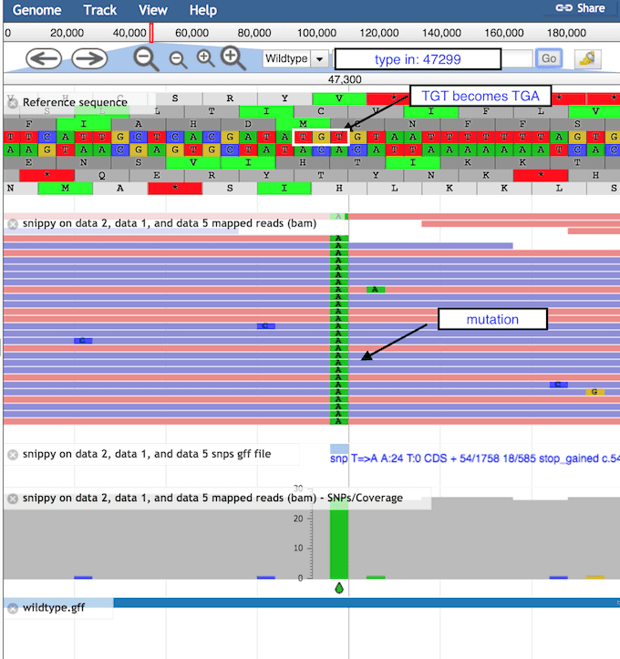

## Visualization & stats per domain

- **IGV** / **JBrowse2** (variants — strand / end / homopolymer artifacts; JBrowse2 = shareable)
- **Volcano / MA / PCA** (RNA-seq) · **genome maps / Krona** (phage) · **Circos** (SV / CNV / comparative)
- Effect size + significance; multiple testing everywhere; differential ≠ functional

<!-- The IGV strand-bias story and the PCA-clusters-by-date (= batch effect) story. JBrowse2 embeds in a report/shared workflow; Circos is the circular multi-track view for structural/comparative genomics — powerful but fiddly. -->

---

## What a good report contains

- Question / design · **methods WITH versions** · QC summary
- Results **with uncertainty** · bounded interpretation · reproducibility pointers

> "BWA-MEM" ≠ reproducible; "BWA-MEM 0.7.17, GRCh38, default params" is.

<!-- A report a reviewer can't reproduce from the methods is scientifically incomplete. -->

---

<!-- _class: skeleton -->

<p class="eyebrow">MODULE 5 · REPRODUCIBILITY</p>

## Reproducibility wraps everything

```
[ Design → QC → Preprocess → Core → Downstream → Interpret ]
                  ↳ all of it inside REPRODUCIBILITY
```

- Why a workflow manager: **resume · parallelism · portability · reproducibility**

<!-- Not a final step — the box around the whole skeleton. -->

---

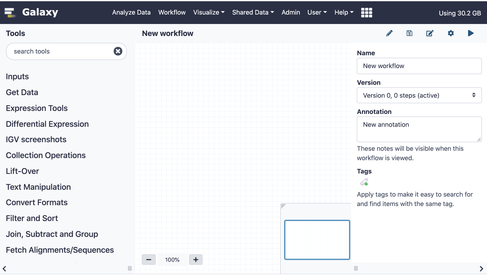

## Workflow managers & environments

- **Nextflow + nf-core**: sarek=3a · rnaseq=3b · mag=3c | **Snakemake** (Pythonic, file rules)
- **conda / mamba** (pin versions!) + **containers** (Docker / Singularity / Apptainer)

> Everything you did by hand, **nf-core runs for you** — now you can trust / configure / debug it.

<!-- THE punchline. They understand each stage now, so the pipelines aren't black boxes. GUI alternative (GTN): Galaxy is itself a GUI workflow manager with provenance by default — Creating/editing workflows, the history system, Workflow Reports (shareable run reports), and reproducing a published analysis → topics/galaxy-interface/ and topics/introduction/tutorials/galaxy-reproduce/ -->

---

## Provenance & close

- Version pinning · parameter logging · **seeds** · git for code · data in SRA / ENA / Zenodo

> The reproducibility test: could you (or someone) regenerate these exact results in 2 years?

<!-- Recap the skeleton one last time; point them to the hands-on lab. Close. -->

---

<!-- _class: lead -->
<!-- _paginate: false -->

<p class="eyebrow">ONE SKELETON · MANY INSTANCES</p>

# Thank you

## Now: the hands-on lab — align + call on *E. coli*, assemble + identify on a phage

- Notes: `notes/00–05` · Lab: `hands-on/tutorial.md` · Refs: `resources/references.md`
- Prefer a GUI? Each module has a **↗ Try it in Galaxy** pointer → [Galaxy Training Network](https://training.galaxyproject.org/)

<!-- Hand off to the lab. Create the env first: mamba env create -f hands-on/environment.yml. -->
